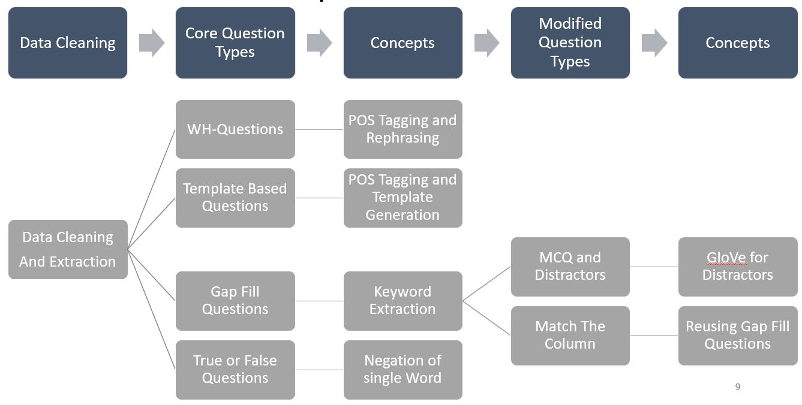
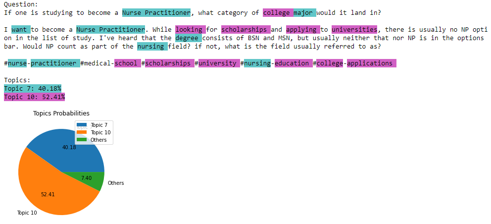
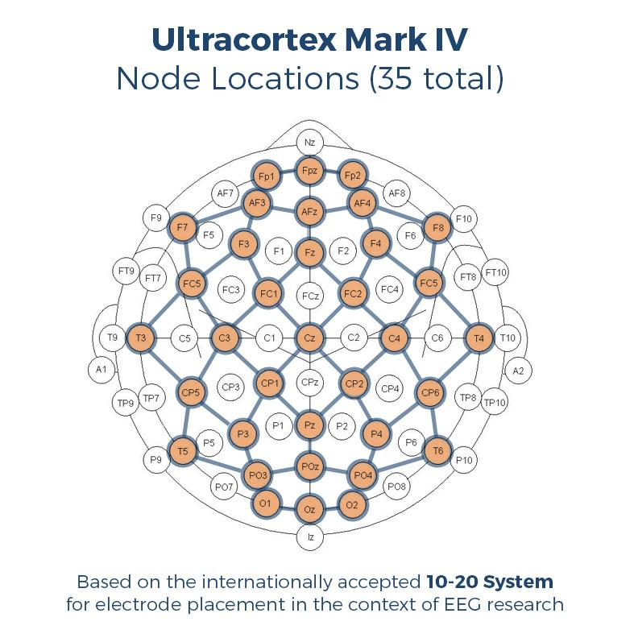

# Hello, I am Shubham Kurlekar.

# These are some of my projects

# [1 - No Dislikes? No Problem! Comments don't lie.](https://github.com/shubhamk8597/alternative_youtube_dislikes)

So, recently youtube decided that it will not show the number of dislikes for a video. Being an avid youtube user, this update did not help me in any way. The number of dislikes and the ratio of likes to dislikes helped me in making the decision whether to watch the video or not in a split second. But now I was helpless. I could not decide on which videos should I invest my precious time on.

I was not going to let YouTube have its way. I decided to use my data science skills to solve this problem.
For anyone who wants to decide where to watch a YouTube video or not.

Click [here](https://share.streamlit.io/shubhamk8597/alternative_youtube_dislikes/main/yt_comment_nlp.py) to try out the application.

* YouTube API handling to get comments of a particular video.
* Text cleaning for better sentiment analysis.
* Sentiment analysis of English comments using VADER from nltk.
* Visualizing the results in the form of wordcloud, pie chart and line chart.
* Deploying the application on streamlit for public use.

# [2 - Automatic Question Generation From Technical Learning Material.](https://github.com/shubhamk8597/College-Project--Automatic-Question-Generation-From-Educational-Text)

Automatic Question Generation from Technical texts
- Eliminated unknown unrecognized symbols in data cleaning which made the model 15% better
- Summarization using BERT Extractive Summarizer giving only important sentences and making the process faster by 35%

Found Drawbacks of WH -Question and Template Based Questions
- Tedious task of defining very specific rules for every POS tag which takes away the goal of automation.
- No labeled technical data to train the model

Gap Fill Questions and MCQ(Multiple Choice Questions) with 60% relevant questions
- Keyword extraction with Python keyword extractor (PKE) to generate Gap Fill Questions
- Using Gensim golve2word2vec to generate distractors for MCQ 

True and False Questions 55% relevant questions
- New Question Type which was not covered in any AQG research papers
- True and False questions by generating opposite words of keywords by using wordnet from NLTK library

Match the column 67% Relevant Questions
- Modified MCQ concepts to generate a new question type that will help students to learn more concepts in a single question

User Interface
- Built a UI by using Pyqt5 library
- UI for teachers to validate and evaluate questions (Human In the Loop)
- UI for students to practice different kinds of questions

# [3 - Recommending Right Content To Right Users.](https://github.com/shubhamk8597/Project---Recommending-Right-Content-To-Right-Users/blob/main/README.md)

* Extensive EDA (Exploratory Data Analysis ) with Bubble charts, Word clouds, Bar and Pie charts
* NLP(Natural Language Processing) Pipeline to clean and extract relevant data.(TF-IDF)
* Tuned Gensim and LDA (Latent Dirichlet allocation) model for close expected results ( alpha = 0.02)
* LDA visualization with pyLDAvis for more insights
* Recommending questions using cosine similarity, Jaccard similarity and ranking the recommendation (based on final_score= ∑s ∈ S (s_ weight ∗ s_value )

# [4 - Predicting Cognetive States of Pilots By Analysing Physiological Data](https://github.com/shubhamk8597/Project---Predicting-Cognetive-States-of-Pilots-By-Analysing-Physiological-Data)

* Researched in depth the data of EEG(Electroencephalogram) and ECG(Electrocardiogram) for clear insights
* EDA(Exploratory Data Analysis) by Distribution plots and Violin plots to compare different physiological data
* Gradient boosting with LightBGM to extract important features visualizing the prediction with the help of a confusion matrix
* Reduced the log loss to .03213 from .03830 
* The average accuracy of 96.25% was obtained with 99% accuracy on the most important data point.

